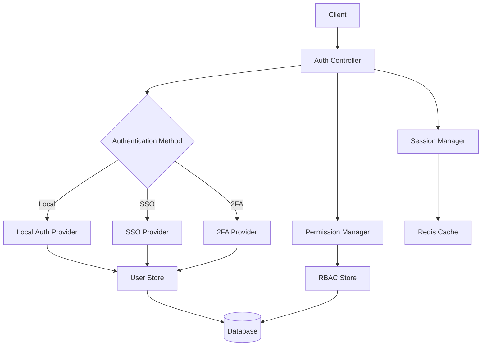

## 1\. Overview

The Auth component in Sentry is responsible for managing user authentication and authorization. It ensures that only authorized users can access the Sentry platform and that they have the appropriate permissions for their actions. This component is crucial for maintaining the security and integrity of the Sentry system.

## 2\. Key Features

- User authentication (login/logout)

- Single Sign-On (SSO) support

- Two-Factor Authentication (2FA)

- Role-Based Access Control (RBAC)

- Password management (reset, change)

- Session management

- API token generation and validation

## 3\. Architecture/Design

The Auth component is designed with a modular architecture to support various authentication methods and integrate seamlessly with the rest of the Sentry system.



Key components:

- Auth Controller: Handles incoming authentication requests

- Authentication Providers: Implement different auth methods (Local, SSO, 2FA)

- Session Manager: Manages user sessions

- Permission Manager: Enforces RBAC

- User Store: Stores user credentials and profile information

- RBAC Store: Stores role and permission data

## 4\. Usage/Implementation

To use the Auth component in Sentry:

1. Configure authentication providers in `sentry/conf/server.py`

2. Implement authentication in views using decorators:

```
python
```

Copy

`from sentry.auth import login_required @login_required def protected_view(request): # Your view logic here`

3. Check permissions in views:

```
python
```

Copy

`from sentry.auth import has_permission if has_permission(request.user, 'project:write', project): # Perform action requiring write permission`

## 5\. Examples

### Implementing SSO for a new provider:

1. Create a new file `sentry/auth/providers/new_sso_provider.py`:

```
from sentry.auth.providers.oauth2 import OAuth2Provider class NewSSOProvider(OAuth2Provider): name = 'New SSO Provider' def get_auth_pipeline(self): return [ # Define authentication pipeline steps ] def build_config(self, state): return { 'authorize_url': 'https://newsso.example.com/authorize', 'client_id': self.get_option('client_id'), 'client_secret': self.get_option('client_secret'), }
```

2. Register the provider in `sentry/conf/server.py`:

```
python
```

Copy

`SENTRY_AUTH_PROVIDERS = { # ... other providers ... 'new_sso_provider': 'sentry.auth.providers.new_sso_provider.NewSSOProvider', }`

## 6\. Troubleshooting

Common issues and solutions:

1. User unable to log in

   - Check if the user account is active

   - Verify correct credentials are being used

   - Ensure the authentication provider is properly configured

2. SSO not working

   - Verify SSO provider configuration (client ID, secret, URLs)

   - Check Sentry logs for detailed error messages

   - Ensure the SSO provider is sending the required user information

3. Permissions issues

   - Review the user's role assignments

   - Check if the required permissions are assigned to the role

   - Verify that the permission check is implemented correctly in the view

## 7\. Related Components

- User Management: Handles user profile information and account settings

- API: Uses Auth component for authenticating API requests

- Web Interface: Integrates with Auth for user login and session management

- Audit Log: Records authentication and authorization events

&nbsp;

<SwmMeta version="3.0.0" repo-id="Z2l0aHViJTNBJTNBc2VudHJ5LWNsYXVkZSUzQSUzQXNodWp1dXU=" repo-name="sentry-claude"><sup>Powered by [Swimm](https://app.swimm.io/)</sup></SwmMeta>
