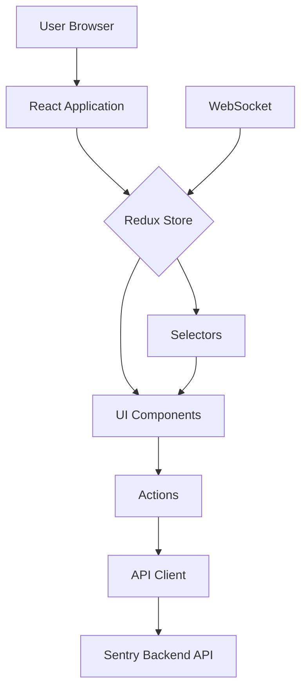

## 1\. Overview

The Frontend module in Sentry is responsible for rendering the user interface and handling client-side interactions. It provides a responsive, intuitive interface for users to monitor, analyze, and manage errors and performance issues in their applications.

## 2\. Key Features

- Interactive dashboards for error and performance monitoring

- Real-time updates of incoming events

- Customizable views and filters

- Data visualization (charts, graphs, tables)

- Issue management interface

- User and team management UI

- Project settings and configuration

## 3\. Architecture/Design

The Frontend module is built as a single-page application (SPA) using modern web technologies.



Key components:

- React Application: The core of the frontend, managing the overall structure and routing

- Redux Store: Centralized state management

- UI Components: Reusable React components for building the interface

- Actions: Redux actions for triggering state changes

- API Client: Handles communication with the Sentry backend API

- Selectors: Efficient data retrieval from the Redux store

- WebSocket: Enables real-time updates from the server

## 4\. Usage/Implementation

To work on the Frontend module:

1. Set up the development environment:

```
# Install dependencies
npm install

# Start the development server
npm run dev
```

2. Create new components in `src/components`:

```
// src/components/MyNewComponent.jsx
import React from 'react';

const MyNewComponent = ({ prop1, prop2 }) => (
  <div>
    <h1>{prop1}</h1>
    <p>{prop2}</p>
  </div>
);

export default MyNewComponent;
```

3. Add new routes in `src/routes.jsx`:

```
import MyNewComponent from './components/MyNewComponent';

const routes = [
  // ... existing routes ...
  {
    path: '/new-feature',
    component: MyNewComponent,
  },
];
```

4. Implement Redux actions and reducers for new features:

```
// src/actions/myNewFeature.js
export const MY_NEW_ACTION = 'MY_NEW_ACTION';

export const myNewAction = (payload) => ({
  type: MY_NEW_ACTION,
  payload,
});

// src/reducers/myNewFeature.js
import { MY_NEW_ACTION } from '../actions/myNewFeature';

const initialState = {
  // ... initial state ...
};

export default function myNewFeatureReducer(state = initialState, action) {
  switch (action.type) {
    case MY_NEW_ACTION:
      return {
        ...state,
        // ... handle action ...
      };
    default:
      return state;
  }
}
```

## 5\. Examples

### Creating a new dashboard widget:

1. Create a new component file `src/components/widgets/MyNewWidget.jsx`:

```

```

<SwmMeta version="3.0.0" repo-id="Z2l0aHViJTNBJTNBc2VudHJ5LWNsYXVkZSUzQSUzQXNodWp1dXU=" repo-name="sentry-claude"><sup>Powered by [Swimm](https://app.swimm.io/)</sup></SwmMeta>
