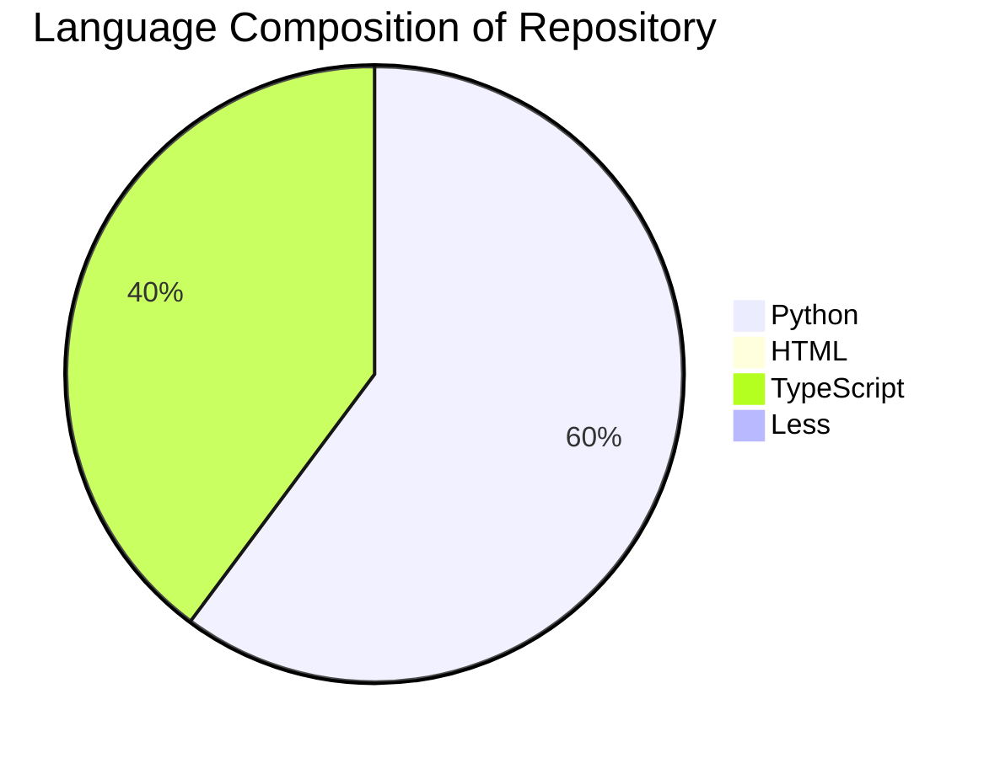
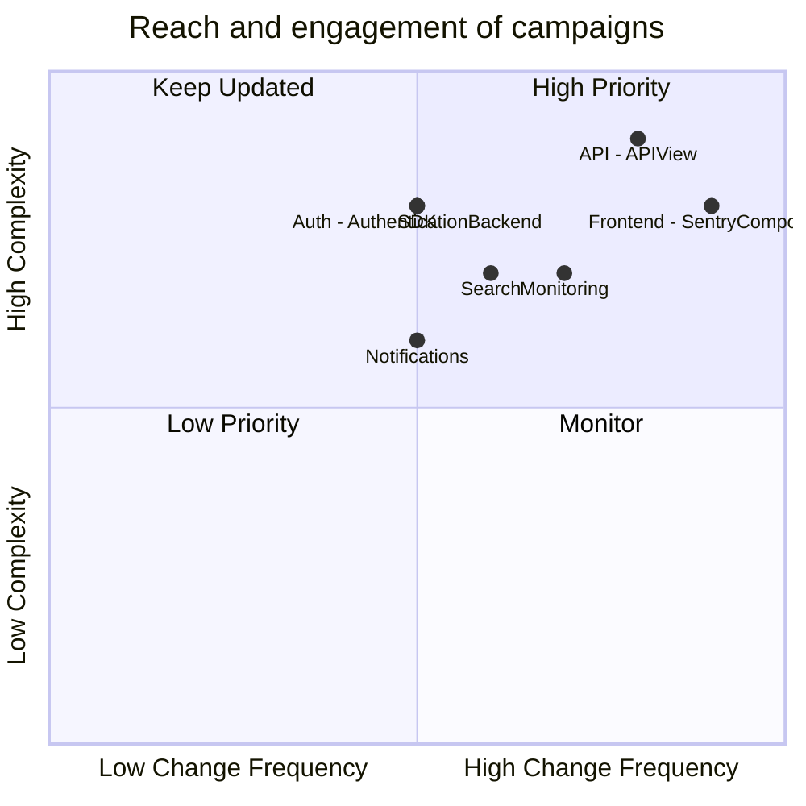

## Overview

- Total Components: 25+

- High Priority Components: 5

- Overall Modernization Progress: 75%

### Languages

- Python: 59.7%
- HTML: 0.4%
- TypeSCript: 39.5%
- Less: 0.3%

&nbsp;

### Important paths & files

- <SwmPath>[build-utils/](/build-utils/)</SwmPath>- where the build tools is stored
- <SwmPath>[static/app/components/](/static/app/components/)</SwmPath> - where main components appear
- <SwmPath>[src/sentry_plugins/](/src/sentry_plugins/)</SwmPath> - third-party integrations

&nbsp;

### Component priority matrix

| Component Name  | Type       | Complexity (1-10) | Change Frequency | Modernization Priority | Key Dependencies | Notes                              |
| --------------- | ---------- | ----------------- | ---------------- | ---------------------- | ---------------- | ---------------------------------- |
| Web Interface   | Module     | 8                 | Daily            | High                   | React, API       | Consider migrating to Next.js      |
| Error Ingestion | Flow       | 9                 | Weekly           | High                   | Kafka, Redis     | Optimize for higher throughput     |
| Search          | Module     | 7                 | Monthly          | Medium                 | Elasticsearch    | Evaluate newer search technologies |
| Notifications   | Sub-module | 6                 | Bi-weekly        | Medium                 | Celery, SMTP     | Implement more delivery channels   |

&nbsp;

### Sentry Component Priority Matrix

&nbsp;

## High Priority Actions

1. Migrate web interface to Next.js for improved performance and SEO

2. Optimize error ingestion pipeline for higher throughput

3. Standardize SDK implementations across different programming languages

### Recent Changes

- 2023-09-01: Implemented new grouping algorithms for more accurate issue tracking
- 2023-08-15: Upgraded Elasticsearch to version 7.x for improved search capabilities
- 2023-07-30: Introduced new API endpoints for better third-party integrations

## Edge Cases and Risks

- Error Ingestion: Potential data loss during extremely high traffic scenarios

- Search: Performance degradation for organizations with massive amounts of event data

- Notifications: Delivery failures for certain email providers

## Next Steps

1. Conduct a comprehensive performance audit of the error ingestion pipeline

2. Explore serverless architectures for certain microservices

3. Implement a more robust feature flagging system for easier A/B testing

<SwmMeta version="3.0.0" repo-id="Z2l0aHViJTNBJTNBc2VudHJ5LWNsYXVkZSUzQSUzQXNodWp1dXU=" repo-name="sentry-claude">Powered by [Swimm](https://app.swimm.io/)</SwmMeta>
