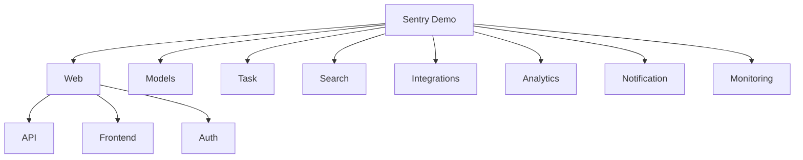

Sentry is an open-source error tracking and performance monitoring platform. It helps developers identify, triage, and resolve code errors and performance issues in real-time.

## Architecture

## Main and sub-modules

### 1\. Web&nbsp;

The Web module handles HTTP requests, renders the user interface, and provides API endpoints. Read in-depth documentation at <SwmLink doc-title="Web module">[Web module](/.swm/web-module.ieqty71c.sw.md)</SwmLink> or find module at <SwmPath>[src/sentry/web/](/src/sentry/web/)</SwmPath>

Key Components:&nbsp;

- API
- Front-end
- Auth&nbsp;

### 2\. Models&nbsp;

The Models module defines the database schema and object-relational mapping (ORM) for Sentry's data. You can read more at  <SwmLink doc-title="Models Overview (sentry/models)">[Models Overview (sentry/models)](/.swm/models-overview-sentrymodels.eft70avm.sw.md)</SwmLink> and look up the files inside <SwmPath>[src/sentry/models/](/src/sentry/models/)</SwmPath>

Key Components:&nbsp;

- Core Models
- Event Models
- Identiry and Authentication Models
- Integration Models
- Configura Models
- Monitoring Models
- Release and Deployment Models

### 3\. Tasks&nbsp;

The Search module provides indexing and querying capabilities for Sentry data. Read more at&nbsp;\
<SwmLink doc-title="Tasks Module">[Tasks Module](/.swm/tasks-module.1me8kyjl.sw.md)</SwmLink> or work on the modules at <SwmPath>[src/sentry/dynamic_sampling/tasks/](/src/sentry/dynamic_sampling/tasks/)</SwmPath>

Key Components:&nbsp;

- Event Processing
- Notification Tasks
- Data Cleanup
- Integration Sync
- Monitoring Tasks&nbsp;
- Analytics Tasks
- Scheduled Maintenance
- Release Management

### 4\. Search&nbsp;

The Search module provides indexing and querying capabilities for Sentry data. You can read more at <SwmLink doc-title="Search Module">[Search Module](/.swm/search-module.g0arjzdb.sw.md)</SwmLink>  or look for code sources at <SwmPath>[src/sentry/search/](/src/sentry/search/)</SwmPath>

Key Components:&nbsp;

- Indexing&nbsp;
- Query Engine

### 5\. Integrations&nbsp;

The Integrations module manages connections between Sentry and external services. Read more at <SwmLink doc-title=" Integrations Module">[ Integrations Module](/.swm/integrations-module.djr8v1w1.sw.md)</SwmLink> and find its modules at  <SwmPath>[src/sentry/integrations/](/src/sentry/integrations/)</SwmPath>

- Third-party Services&nbsp;
- Plugins&nbsp;

### 6\. Analytics&nbsp;

The Analytics module tracks usage and generates insights about Sentry usage. Read more at <SwmLink doc-title="Analytics Module">[Analytics Module](/.swm/analytics-module.oehpupsr.sw.md)</SwmLink>  and find module at <SwmPath>[src/sentry/analytics/](/src/sentry/analytics/)</SwmPath>

Key Components:&nbsp;

- Event Processing&nbsp;
- Reporting

### 7\. Notification

The Notifications module manages the sending of alerts and updates to users. Read about at <SwmLink doc-title="Notifications Module">[Notifications Module](/.swm/notifications-module.ijo7zfhg.sw.md)</SwmLink> or find module at <SwmPath>[src/sentry/notifications/](/src/sentry/notifications/)</SwmPath>

Key Components:&nbsp;

- Email&nbsp;
- Webhooks

### 8\. Monitoring&nbsp;

The Monitoring module tracks the health and performance of Sentry itself. Read about the module at <SwmLink doc-title="Monitoring Module">[Monitoring Module](/.swm/monitoring-module.jeo6vbzv.sw.md)</SwmLink> and look for code sources at <SwmPath>[src/sentry/monitoring/](/src/sentry/monitoring/)</SwmPath>, <SwmPath>[src/sentry/monitors/](/src/sentry/monitors/)</SwmPath>

Key Components:&nbsp;

- Performance&nbsp;
- Alerts

&nbsp;

### Relevant Docs

- <SwmLink doc-title="Modernization dashboard">[Modernization dashboard](/.swm/modernization-dashboard.syb66d5b.sw.md)</SwmLink>
- <SwmLink doc-title="Glossary">[Glossary](/.swm/glossary.be2fzwhy.sw.md)</SwmLink>
- <SwmLink doc-title="Build Tools">[Build Tools](/.swm/build-tools.87ztd8xv.sw.md)</SwmLink>

&nbsp;

<SwmMeta version="3.0.0" repo-id="Z2l0aHViJTNBJTNBc2VudHJ5LWNsYXVkZSUzQSUzQXNodWp1dXU=" repo-name="sentry-claude">Powered by [Swimm](https://app.swimm.io/)</SwmMeta>
