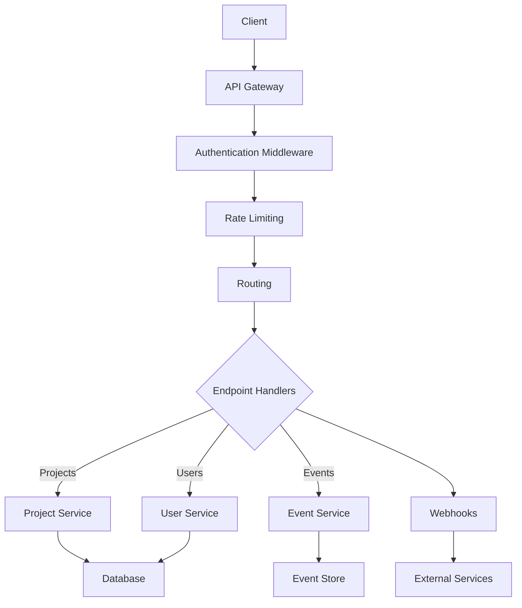

## 1\. Overview

The API module in Sentry provides a RESTful interface for programmatic access to Sentry's functionality. It allows developers to integrate Sentry with other tools, automate tasks, and build custom applications on top of Sentry's data and features.

## 2\. Key Features

- RESTful endpoints for all major Sentry resources

- Authentication and authorization

- Pagination for large datasets

- Filtering and sorting options

- Rate limiting

- Webhook support for real-time notifications

- API versioning

- CRUD operations for projects, teams, and organizations

- Event ingestion endpoints

- Query and analytics endpoints

## 3\. Architecture/Design

The API module is designed with a layered architecture to ensure modularity, scalability, and ease of maintenance.



Key components:

- React Application: The core of the frontend, managing the overall structure and routing

- Redux Store: Centralized state management

- UI Components: Reusable React components for building the interface

- Actions: Redux actions for triggering state changes

- API Client: Handles communication with the Sentry backend API

- Selectors: Efficient data retrieval from the Redux store

- WebSocket: Enables real-time updates from the server

## 4\. Usage/Implementation

To work on the Frontend module:

1. Set up the development environment:

```
# Install dependencies npm install # Start the development server npm run dev
```

2. Create new components in `src/components`:

```
// src/components/MyNewComponent.jsx import React from 'react'; const MyNewComponent = ({ prop1, prop2 }) => ( <div> <h1>{prop1}</h1> <p>{prop2}</p> </div> ); export default MyNewComponent;
```

3. Add new routes in `src/routes.jsx`:

```
import MyNewComponent from './components/MyNewComponent'; const routes = [ // ... existing routes ... { path: '/new-feature', component: MyNewComponent, }, ];
```

4. Implement Redux actions and reducers for new features:

```
// src/actions/myNewFeature.js export const MY_NEW_ACTION = 'MY_NEW_ACTION'; export const myNewAction = (payload) => ({ type: MY_NEW_ACTION, payload, }); // src/reducers/myNewFeature.js import { MY_NEW_ACTION } from '../actions/myNewFeature'; const initialState = { // ... initial state ... }; export default function myNewFeatureReducer(state = initialState, action) { switch (action.type) { case MY_NEW_ACTION: return { ...state, // ... handle action ... }; default: return state; } }
```

## 5\. Examples

### Creating a new dashboard widget:

1. Create a new component file `src/components/widgets/MyNewWidget.jsx`:

```
import React from 'react'; import { useSelector } from 'react-redux'; const MyNewWidget = () => { const data = useSelector(state => state.myNewFeature.data); return ( <div className="widget"> <h3>My New Widget</h3> <ul> {data.map(item => ( <li key={item.id}>{item.name}</li> ))} </ul> </div> ); }; export default MyNewWidget;
```

2. Add the widget to the dashboard in `src/views/Dashboard.jsx`:

```
import MyNewWidget from '../components/widgets/MyNewWidget'; const Dashboard = () => ( <div className="dashboard"> {/* ... other widgets ... */} <MyNewWidget /> </div> );
```

## 6\. Troubleshooting

Common issues and solutions:

1. Slow performance

   - Use React DevTools to identify unnecessary re-renders

   - Optimize Redux selectors with memoization

   - Implement code splitting for large components

2. State management issues

   - Use Redux DevTools to inspect state changes

   - Ensure actions are being dispatched correctly

   - Check that reducers are pure functions

3. API integration problems

   - Verify API endpoints and request formatting

   - Check for CORS issues in the browser console

   - Use network tab in browser DevTools to inspect requests/responses

## 7\. Related Components

- API: Provides data for the frontend to consume

- Auth: Handles user authentication and permissions

- Models: Defines the data structures used in the frontend

- Analytics: Provides data for dashboards and visualizations

For more information on these components, refer to their respective documentation pages.

&nbsp;</antArtifact>&nbsp;

Now, let's create the documentation for the API module:

Sentry API Module Documentation

Click to open document

Key components:

- API Gateway: Handles incoming requests and applies global middleware

- Authentication Middleware: Verifies API tokens and user permissions

- Rate Limiting: Enforces usage limits to prevent abuse

- Routing: Directs requests to appropriate endpoint handlers

- Endpoint Handlers: Implement the business logic for each API endpoint

- Services: Encapsulate data access and complex operations

- Webhooks: Send real-time notifications to external services

## 4\. Usage/Implementation

To use the Sentry API:

1. Obtain an API token from the Sentry web interface

2. Include the token in the `Authorization` header of your requests:

```
Authorization: Bearer YOUR_API_TOKEN
```

3. Make requests to the API endpoints. For example, to get a list of projects:

```
curl -H "Authorization: Bearer YOUR_API_TOKEN" \ https://sentry.io/api/0/projects/
```

To implement a new API endpoint:

1. Create a new file in `src/sentry/api/endpoints/`:

```
# src/sentry/api/endpoints/my_new_endpoint.py
from sentry.api.base import Endpoint
from sentry.api.permissions import SuperuserPermission

class MyNewEndpoint(Endpoint):
    permission_classes = (SuperuserPermission,)

    def get(self, request):
        # Implement GET logic
        return Response({'message': 'Hello, World!'})

    def post(self, request):
        # Implement POST logic
        return Response({'status': 'created'}, status=201)
```

2. Register the endpoint in `src/sentry/api/urls.py`:

```
from .endpoints.my_new_endpoint import MyNewEndpoint

urlpatterns = [
    # ... existing patterns ...
    url(r'^my-new-endpoint/$', MyNewEndpoint.as_view(), name='sentry-api-0-my-new-endpoint'),
]
```

## 5\. Examples

### Implementing a custom analytics endpoint:

```
# src/sentry/api/endpoints/project_error_counts.py
from sentry.api.base import Endpoint
from sentry.api.permissions import ProjectPermission
from sentry.models import Project, Group
from django.db.models import Count
from django.utils import timezone

class ProjectErrorCountsEndpoint(Endpoint):
    permission_classes = (ProjectPermission,)

    def get(self, request, project_id):
        try:
            project = Project.objects.get(id=project_id)
        except Project.DoesNotExist:
            return Response({'error': 'Project not found'}, status=404)

        self.check_object_permissions(request, project)

        days = int(request.GET.get('days', 7))
        since = timezone.now() - timezone.timedelta(days=days)

        error_counts = Group.objects.filter(
            project=project,
            first_seen__gte=since
        ).values('level').annotate(count=Count('id'))

        return Response(error_counts)
```

## 6\. Troubleshooting

Common issues and solutions:

1. Authentication errors

   - Verify that the API token is correct and not expired

   - Check that the token has the necessary scopes for the requested operation

   - Ensure the `Authorization` header is correctly formatted

2. Rate limiting

   - Implement exponential backoff in your client code

   - Consider using batch operations to reduce the number of API calls

   - Contact Sentry support if you need a higher rate limit

3. Data inconsistencies

   - Check that you're using the latest version of the API

   - Verify that your requests include all required parameters

   - Use the `sentry-trace` header to correlate API requests with server-side logs

## 7\. Related Components

- Models: Define the data structures used by the API

- Auth: Handles API authentication and authorization

- Event Ingestion: Processes events submitted via the API

- Search: Powers the query capabilities of certain API endpoints

<SwmMeta version="3.0.0" repo-id="Z2l0aHViJTNBJTNBc2VudHJ5LWNsYXVkZSUzQSUzQXNodWp1dXU=" repo-name="sentry-claude"><sup>Powered by [Swimm](https://app.swimm.io/)</sup></SwmMeta>
