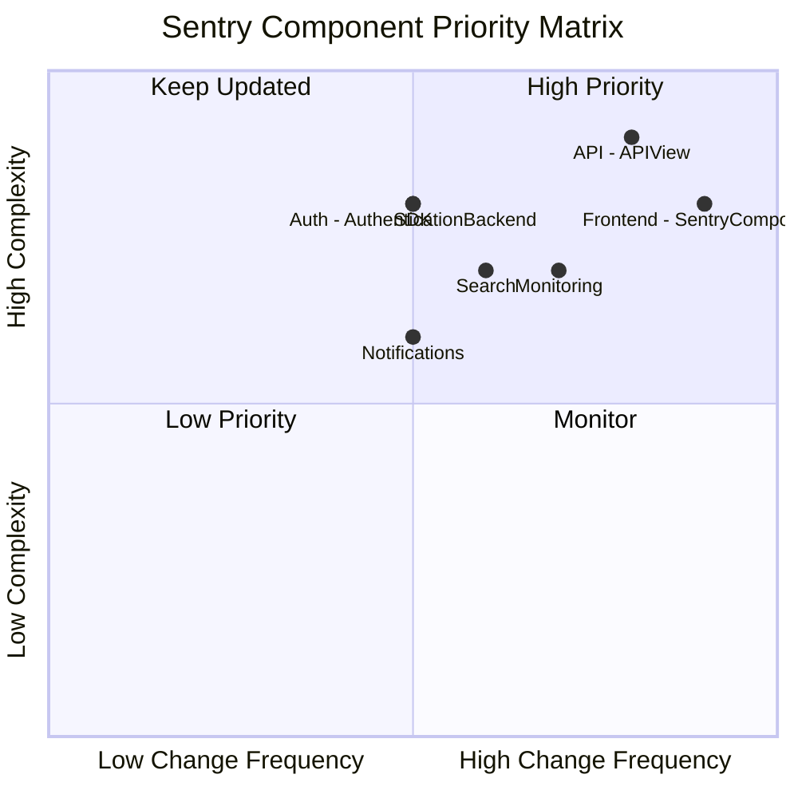

## Overview

- Total Components: 25+

- High Priority Components: 5

- Overall Modernization Progress: 75%

## Component Priority Matrix

| Component Name               | Type   | Complexity (1-10) | Change Frequency | Modernization Priority | Key Dependencies      | Notes                                                    |
| ---------------------------- | ------ | ----------------- | ---------------- | ---------------------- | --------------------- | -------------------------------------------------------- |
| API (APIView)                | Class  | 9                 | Weekly           | High                   | Django, Auth          | Consider migrating to GraphQL for more efficient queries |
| Frontend (SentryComponent)   | Class  | 8                 | Daily            | High                   | React, Redux          | Evaluate migration to Next.js for improved performance   |
| Auth (AuthenticationBackend) | Class  | 8                 | Monthly          | High                   | Django, SSO Providers | Implement more robust token management                   |
| Search                       | Module | 7                 | Bi-weekly        | Medium                 | Elasticsearch         | Optimize query performance for large datasets            |
| Notifications                | Module | 6                 | Monthly          | Medium                 | Celery, SMTP          | Implement more delivery channels and improve reliability |
| SDK                          | Module | 8                 | Monthly          | High                   | Multiple languages    | Standardize error capturing across languages             |
| Monitoring                   | Module | 7                 | Weekly           | High                   | Prometheus, Grafana   | Enhance self-monitoring capabilities                     |

&nbsp;

## High Priority Actions

1. Migrate web interface to Next.js for improved performance and SEO

2. Optimize error ingestion pipeline for higher throughput

3. Standardize SDK implementations across different programming languages

## Recent Changes

- 2023-09-01: Implemented new grouping algorithms for more accurate issue tracking

- 2023-08-15: Upgraded Elasticsearch to version 7.x for improved search capabilities

- 2023-07-30: Introduced new API endpoints for better third-party integrations

## Edge Cases and Risks

- Error Ingestion: Potential data loss during extremely high traffic scenarios

- Search: Performance degradation for organizations with massive amounts of event data

- Notifications: Delivery failures for certain email providers

## Next Steps

1. Conduct a comprehensive performance audit of the error ingestion pipeline

2. Explore serverless architectures for certain microservices

3. Implement a more robust feature flagging system for easier A/B testing

<SwmMeta version="3.0.0" repo-id="Z2l0aHViJTNBJTNBc2VudHJ5LWNsYXVkZSUzQSUzQXNodWp1dXU=" repo-name="sentry-claude">Powered by [Swimm](https://app.swimm.io/)</SwmMeta>
